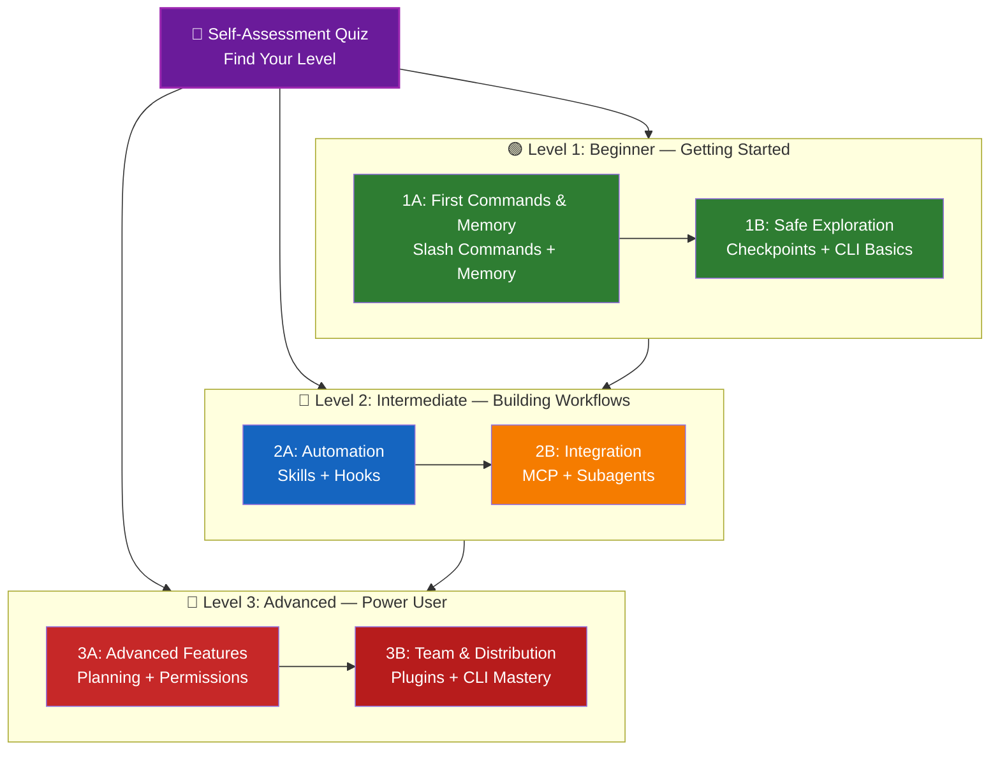

<picture>
  <source media="(prefers-color-scheme: dark)" srcset="resources/logos/claude-howto-logo-dark.svg">
  
</picture>

# 📚 Claude Code Learning Roadmap

**New to Claude Code?** This guide helps you master Claude Code features at your own pace. Whether you're a complete beginner or an experienced developer, start with the self-assessment quiz below to find the right path for you.

---

## 🧭 Find Your Level

Not everyone starts from the same place. Take this quick self-assessment to find the right entry point.

**Answer these questions honestly:**

- [ ] I can start Claude Code and have a conversation (`claude`)
- [ ] I have created or edited a CLAUDE.md file
- [ ] I have used at least 3 built-in slash commands (e.g., /help, /compact, /model)
- [ ] I have created a custom slash command or skill (SKILL.md)
- [ ] I have configured an MCP server (e.g., GitHub, database)
- [ ] I have set up hooks in ~/.claude/settings.json
- [ ] I have created or used custom subagents (.claude/agents/)
- [ ] I have used print mode (`claude -p`) for scripting or CI/CD

**Your Level:**

| Checks | Level | Start At | Time to Complete |
|--------|-------|----------|------------------|
| 0-2 | **Level 1: Beginner** — Getting Started | [Milestone 1A](#milestone-1a-first-commands--memory) | ~3 hours |
| 3-5 | **Level 2: Intermediate** — Building Workflows | [Milestone 2A](#milestone-2a-automation-skills--hooks) | ~5 hours |
| 6-8 | **Level 3: Advanced** — Power User & Team Lead | [Milestone 3A](#milestone-3a-advanced-features) | ~5 hours |

> **Tip**: If you're unsure, start one level lower. It's better to review familiar material quickly than to miss foundational concepts.

> **Interactive version**: Run `/self-assessment` in Claude Code for a guided, interactive quiz that scores your proficiency across all 10 feature areas and generates a personalized learning path.

---

## 🎯 Learning Philosophy

The folders in this repository are numbered in **recommended learning order** based on three key principles:

1. **Dependencies** - Foundational concepts come first
2. **Complexity** - Easier features before advanced ones
3. **Frequency of Use** - Most common features taught early

This approach ensures you build a solid foundation while gaining immediate productivity benefits.

---

## 🗺️ Your Learning Path



**Color Legend:**
- 💜 Purple: Self-Assessment Quiz
- 🟢 Green: Level 1 — Beginner path
- 🔵 Blue / 🟡 Gold: Level 2 — Intermediate path
- 🔴 Red: Level 3 — Advanced path

---

## 📊 Complete Roadmap Table

| Step | Feature | Complexity | Time | Level | Dependencies | Why Learn This | Key Benefits |
|------|---------|-----------|------|-------|--------------|----------------|--------------|
| **1** | [Slash Commands](01-slash-commands/) | ⭐ Beginner | 30 min | Level 1 | None | Quick productivity wins (55+ built-in + 5 bundled skills) | Instant automation, team standards |
| **2** | [Memory](02-memory/) | ⭐⭐ Beginner+ | 45 min | Level 1 | None | Essential for all features | Persistent context, preferences |
| **3** | [Checkpoints](08-checkpoints/) | ⭐⭐ Intermediate | 45 min | Level 1 | Session management | Safe exploration | Experimentation, recovery |
| **4** | [CLI Basics](10-cli/) | ⭐⭐ Beginner+ | 30 min | Level 1 | None | Core CLI usage | Interactive & print mode |
| **5** | [Skills](03-skills/) | ⭐⭐ Intermediate | 1 hour | Level 2 | Slash Commands | Automatic expertise | Reusable capabilities, consistency |
| **6** | [Hooks](06-hooks/) | ⭐⭐ Intermediate | 1 hour | Level 2 | Tools, Commands | Workflow automation (28 events, 5 types) | Validation, quality gates |
| **7** | [MCP](05-mcp/) | ⭐⭐⭐ Intermediate+ | 1 hour | Level 2 | Configuration | Live data access | Real-time integration, APIs |
| **8** | [Subagents](04-subagents/) | ⭐⭐⭐ Intermediate+ | 1.5 hours | Level 2 | Memory, Commands | Complex task handling (6 built-in including Bash) | Delegation, specialized expertise |
| **9** | [Advanced Features](09-advanced-features/) | ⭐⭐⭐⭐⭐ Advanced | 2-3 hours | Level 3 | All previous | Power user tools | Planning, Auto Mode, Channels, Voice Dictation, permissions |
| **10** | [Plugins](07-plugins/) | ⭐⭐⭐⭐ Advanced | 2 hours | Level 3 | All previous | Complete solutions | Team onboarding, distribution |
| **11** | [CLI Mastery](10-cli/) | ⭐⭐⭐ Advanced | 1 hour | Level 3 | Recommended: All | Master command-line usage | Scripting, CI/CD, automation |

**Total Learning Time**: ~11-13 hours (or jump to your level and save time)

---

## 🧪 Test Your Knowledge

This repository includes two interactive skills you can use anytime in Claude Code to evaluate your understanding:

| Skill | Command | Purpose |
|-------|---------|---------|
| **Self-Assessment** | `/self-assessment` | Evaluate your overall proficiency across all 10 features. Choose Quick (2 min) or Deep (5 min) mode to get a personalized skill profile and learning path. |
| **Lesson Quiz** | `/lesson-quiz [lesson]` | Test your understanding of a specific lesson with 10 questions. Use before a lesson (pre-test), during (progress check), or after (mastery verification). |

**Examples:**
```
/self-assessment                  # Find your overall level
/lesson-quiz hooks                # Quiz on Lesson 06: Hooks
/lesson-quiz 03                   # Quiz on Lesson 03: Skills
/lesson-quiz advanced-features    # Quiz on Lesson 09
```

---

## ⚡ Quick Start Paths

### If You Only Have 15 Minutes
**Goal**: Get your first win

1. Copy one slash command: `cp 01-slash-commands/optimize.md .claude/commands/`
2. Try it in Claude Code: `/optimize`
3. Read: [01-slash-commands/README.md](01-slash-commands/README.md)

**Outcome**: You'll have a working slash command and understand the basics

---

### If You Have 1 Hour
**Goal**: Set up essential productivity tools

1. **Slash commands** (15 min): Copy and test `/optimize` and `/pr`
2. **Project memory** (15 min): Create CLAUDE.md with your project standards
3. **Install a skill** (15 min): Set up code-review skill
4. **Try them together** (15 min): See how they work in harmony

**Outcome**: Basic productivity boost with commands, memory, and auto-skills

---

### If You Have a Weekend
**Goal**: Become proficient with most features

**Saturday Morning** (3 hours):
- Complete Milestone 1A: Slash Commands + Memory
- Complete Milestone 1B: Checkpoints + CLI Basics

**Saturday Afternoon** (3 hours):
- Complete Milestone 2A: Skills + Hooks
- Complete Milestone 2B: MCP + Subagents

**Sunday** (4 hours):
- Complete Milestone 3A: Advanced Features
- Complete Milestone 3B: Plugins + CLI Mastery + CI/CD
- Build a custom plugin for your team

**Outcome**: You'll be a Claude Code power user ready to train others and automate complex workflows

---

## 💡 Learning Tips

### ✅ Do

- **Take the quiz first** to find your starting point
- **Complete hands-on exercises** for each milestone
- **Start simple** and add complexity gradually
- **Test each feature** before moving to the next
- **Take notes** on what works for your workflow
- **Refer back** to earlier concepts as you learn advanced topics
- **Experiment safely** using checkpoints
- **Share knowledge** with your team

### ❌ Don't

- **Skip the prerequisites check** when jumping to a higher level
- **Try to learn everything at once** - it's overwhelming
- **Copy configurations without understanding them** - you won't know how to debug
- **Forget to test** - always verify features work
- **Rush through milestones** - take time to understand
- **Ignore the documentation** - each README has valuable details
- **Work in isolation** - discuss with teammates

---

## 🎓 Learning Styles

### Visual Learners
- Study the mermaid diagrams in each README
- Watch the command execution flow
- Draw your own workflow diagrams
- Use the visual learning path above

### Hands-on Learners
- Complete every hands-on exercise
- Experiment with variations
- Break things and fix them (use checkpoints!)
- Create your own examples

### Reading Learners
- Read each README thoroughly
- Study the code examples
- Review the comparison tables
- Read the blog posts linked in resources

### Social Learners
- Set up pair programming sessions
- Teach concepts to teammates
- Join Claude Code community discussions
- Share your custom configurations

---

## 🆘 Common Learning Challenges

### Challenge 1: "Too many concepts at once"
**Solution**: Focus on one milestone at a time. Complete all exercises before moving forward.

### Challenge 2: "Don't know which feature to use when"
**Solution**: Refer to the [Use Case Matrix](README.md#use-case-matrix) in the main README.

### Challenge 3: "Configuration not working"
**Solution**: Check the [Troubleshooting](README.md#troubleshooting) section and verify file locations.

### Challenge 4: "Concepts seem to overlap"
**Solution**: Review the [Feature Comparison](README.md#feature-comparison) table to understand differences.

### Challenge 5: "Hard to remember everything"
**Solution**: Create your own cheat sheet. Use checkpoints to experiment safely.

### Challenge 6: "I'm experienced but not sure where to start"
**Solution**: Take the [Self-Assessment Quiz](#-find-your-level) above. Skip to your level and use the prerequisites check to identify any gaps.

---

## 🎯 What's Next After Completion?

Once you've completed all milestones:

1. **Create team documentation** - Document your team's Claude Code setup
2. **Build custom plugins** - Package your team's workflows
3. **Explore Remote Control** - Control Claude Code sessions programmatically from external tools
4. **Try Web Sessions** - Use Claude Code through browser-based interfaces for remote development
5. **Use the Desktop App** - Access Claude Code features through the native desktop application
6. **Use Auto Mode** - Let Claude work autonomously with a background safety classifier
7. **Leverage Auto Memory** - Let Claude learn your preferences automatically over time
8. **Set up Agent Teams** - Coordinate multiple agents on complex, multi-faceted tasks
9. **Use Channels** - Organize work across structured multi-session workflows
10. **Try Voice Dictation** - Use hands-free voice input for interaction with Claude Code
11. **Use Scheduled Tasks** - Automate recurring checks with `/loop` and cron tools
12. **Contribute examples** - Share with the community
13. **Mentor others** - Help teammates learn
14. **Optimize workflows** - Continuously improve based on usage
15. **Stay updated** - Follow Claude Code releases and new features

---

## 📚 Additional Resources

### Official Documentation
- [Claude Code Documentation](https://code.claude.com/docs/en/overview)
- [Anthropic Documentation](https://docs.anthropic.com)
- [MCP Protocol Specification](https://modelcontextprotocol.io)

### Blog Posts
- [Discovering Claude Code Slash Commands](https://medium.com/@luongnv89/discovering-claude-code-slash-commands-cdc17f0dfb29)

### Community
- [Anthropic Cookbook](https://github.com/anthropics/anthropic-cookbook)
- [MCP Servers Repository](https://github.com/modelcontextprotocol/servers)

---

## 💬 Feedback & Support

- **Found an issue?** Create an issue in the repository
- **Have a suggestion?** Submit a pull request
- **Need help?** Check the documentation or ask the community

---

**Last Updated**: April 24, 2026
**Claude Code Version**: 2.1.119
**Sources**:
- https://code.claude.com/docs/en/overview
- https://code.claude.com/docs/en/hooks
- https://github.com/anthropics/claude-code/releases/tag/v2.1.119
**Compatible Models**: Claude Sonnet 4.6, Claude Opus 4.7, Claude Haiku 4.5
**Maintained by**: Claude How-To Contributors
**License**: Educational purposes, free to use and adapt

---

[← Back to Main README](README.md)
